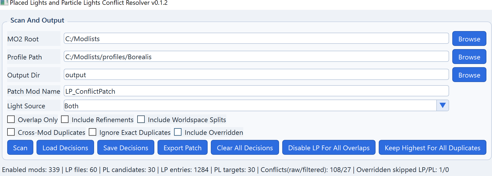
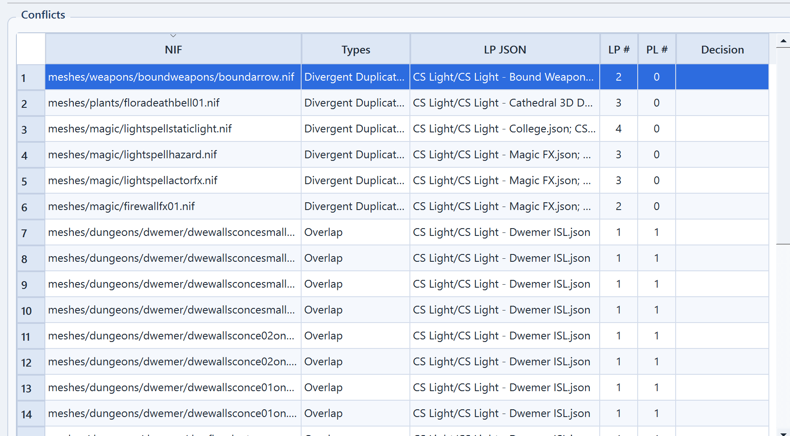
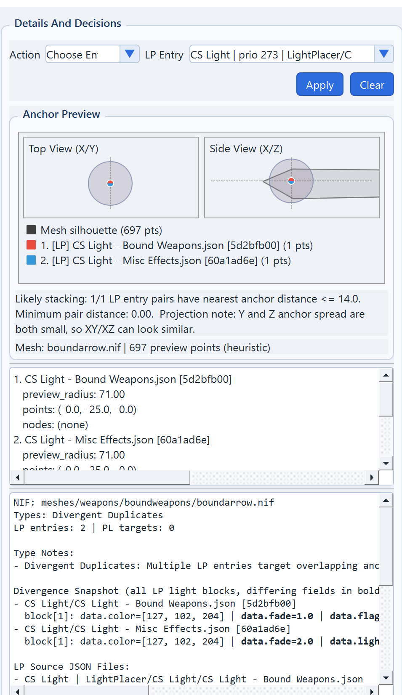
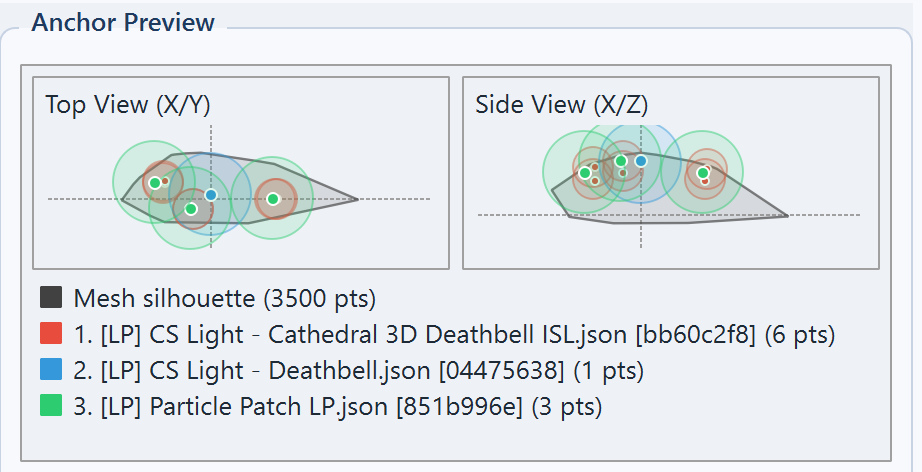

# Placed Lights and Particle Lights Conflict Resolver  
Version: 0.1.3

This guide is for first-time users. It explains what the tool changes, how MO2 load order affects results, and how to export a safe patch.

---

## 1. What This Tool Does

The resolver scans your active MO2 profile and finds lighting conflicts:

- LP vs LP duplicates (same NIF targeted more than once)
- LP vs PL overlaps (Light Placer + ENB Particle Lights on same NIF)

Then it lets you choose which LP entries should stay (single or multiple) and exports an override patch mod.

Important:

- Source mods are not edited.
- The patch works by writing JSON files at the same virtual `LightPlacer/...` paths, so MO2 last-wins behavior applies.

---

## 2. Before You Start (MO2 Load Order Basics)

In MO2, if two mods provide the same file path, only one is effective:

- The mod with higher effective priority (later/overwriting in left pane) wins.
- Lower-priority file is overridden and normally has no in-game effect.

Why this matters:

- With `Include Overridden` OFF (recommended), scan focuses on effective winners only.
- With `Include Overridden` ON, you can inspect hidden/overridden files too (useful for debugging, noisier results).

---

## 3. Quick Start (Recommended Workflow)

1. Open the app.
2. Set:
- `MO2 Root` (folder that contains `mods` and `profiles`)
- `Profile Path` (exact profile folder)
- `Output Dir` (report output)
3. Keep defaults for first scan:
- `Light Source: Both`
- `Overlap Only`: OFF
- `Include Refinements`: OFF
- `Include Worldspace Splits`: OFF
- `Cross-Mod Duplicates`: optional
- `Ignore Exact Duplicates`: optional
- `Include Overridden`: OFF
4. Click `Scan`.
5. Select a conflict row, review right panel:
- Anchor preview (XY/XZ)
- LP/PL entries
- Type notes and divergence snapshot
6. Optional: right-click selected conflict row(s) to open contributing source folder(s) in Windows Explorer.
7. Choose decision in `Action`:
- `Ignore`
- `Keep Highest Priority LP`
- `Choose Entries` (supports selecting multiple LP entries to keep)
- `Disable LP`
8. Click `Apply To Selected`.
9. Optional bulk helpers:
- `Clear All Decisions`
- `Disable All Overlaps`
- `Keep Highest For Duplicates`
10. Repeat for conflicts you care about.
11. Click `Export Patch`.
12. Put patch mod low in MO2 left pane so it wins.
    Place it after `PGPatcher`.

---

## 4. UI Areas (with Screenshot Placeholders)

### A) Scan And Output panel

Use this panel to set paths, scan scope, and filters.

### B) Conflicts table

Each row is one NIF conflict group:

- `Types`: conflict category
- `LP #` / `PL #`: number of involved entries
- `Decision`: current selected action for that NIF
- Right-click row(s): open contributing source folder(s) in Explorer

### C) Details And Decisions panel

Use `Action` + `LP Entries` selection list, then apply decision.  
Anchor preview visualizes approximate overlap and radius relation.
Batch decision helper buttons are available for fast baseline cleanup.

### D) Anchor Preview

- Left: `Top View (X/Y)`
- Right: `Side View (X/Z)`
- Colored circles: LP/PL anchors
- Circle size: preview radius estimate
- Split-color marker: multiple entries at same anchor point

If screenshots are not available yet, keep these image links as placeholders and add files later.

---

## 5. Settings Reference (Practical)

`Light Source`

- `Both`: recommended
- `NIF`: PL from ENB particle-light NIF scan
- `JSON`: PL from JSON only

`Overlap Only`

- Shows only LP vs PL overlaps.
- Good when your goal is "particle lights vs placed lights" cleanup.

`Include Refinements`

- Includes disjoint LP entries that may be intentional detail coverage.
- OFF is cleaner for true stacking work.

`Include Worldspace Splits`

- Includes condition-exclusive variants (for example interior vs exterior).
- Usually not active at same time, so OFF by default.

`Cross-Mod Duplicates`

- Show duplicates only when they come from different mods.

`Ignore Exact Duplicates`

- Hide exact duplicates to focus on divergent conflicts.

`Include Overridden`

- Includes files that are currently overridden in MO2.
- Use for audit/debug, not for normal cleanup.

---

## 6. Conflict Types (How to Interpret)

`Overlap`

- LP and PL both target same NIF.
- Risk: overbright + extra light cost.

`Exact Duplicates`

- LP entries are effectively identical.
- Usually safe to keep one.

`Divergent Duplicates`

- Same/near anchors but settings differ.
- Most likely stacking source.

`Worldspace Splits`

- Divergent entries with mutually exclusive conditions.
- Usually not true simultaneous stacking.

`Refinements`

- Different/disjoint anchor sets.
- Can be intentional, not always redundant.

---

## 7. What Export Actually Writes

Export creates patch files under your patch mod folder:

- override JSONs at original LightPlacer paths (MO2 last-wins)
- `resolver_decisions.json` (saved decisions)
- `resolver_report.md` (summary)
- `resolver_managed_files.json` (tracks generated overrides for cleanup)

Behavior:

- Only changed source paths are written.
- Old stale resolver overrides are removed on later exports.
- Original mods remain untouched.
- If `resolver_decisions.json` exists in Output Dir, it is auto-loaded after scan.
- Stale decisions (no longer matching current conflicts) are skipped safely.
- Using `Save Decisions` also stores the current path fields and patch mod name.

---

## 8. Safety / Rollback

To revert fully:

1. Disable patch mod in MO2.
2. Or delete patch mod folder.
3. Re-export with different decisions any time.

Tip:

- Start with a small subset (for example only `Overlap` conflicts), test in game, then continue.
