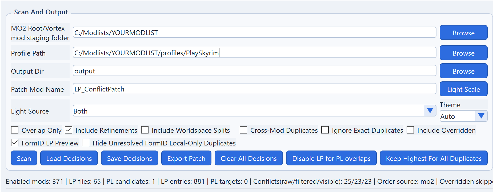
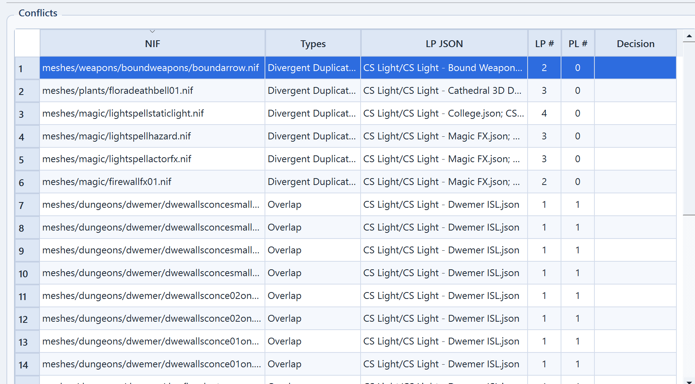
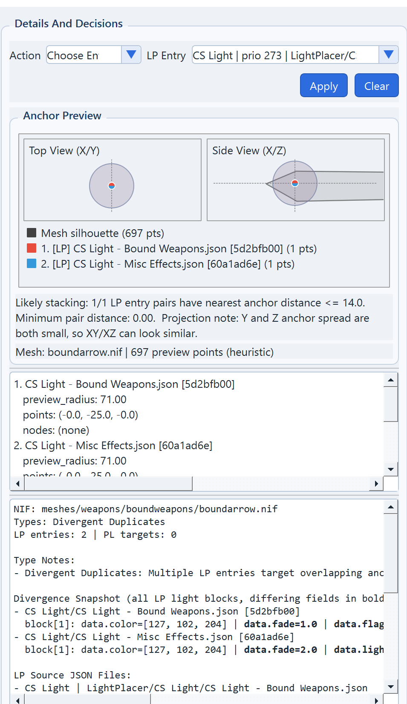
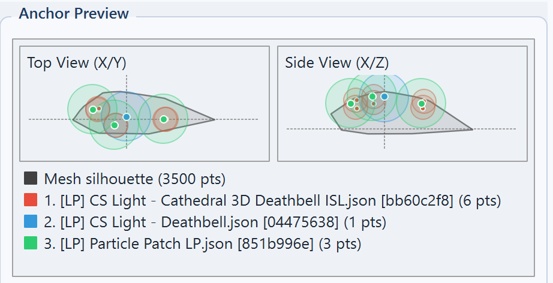

# Placed Lights and Particle Lights Conflict Resolver  
Version: 0.1.7

This guide is for first-time users. It explains what the tool changes, how mod load order affects results (MO2 or Vortex), and how to export a safe patch.

---

## 0. Steam OS/Proton Support

Recommended on SteamOS: run the app with native Linux Python instead of the Windows `.exe` via Proton.

```bash
cd /path/to/lp_resolver
python3 -m venv .venv
source .venv/bin/activate
python -m pip install --upgrade pip
python -m pip install -r requirements.txt
python -m lp_resolver.gui
```

If you still test the Windows `.exe` under Proton, set `Start in` to the app folder and enable logs with:
`PROTON_LOG=1 QT_DEBUG_PLUGINS=1 %command%`

Windows packaged build note:

- The app is `onedir`: keep `LPConflictResolver.exe` and the sibling `_internal` folder together.
- Do not copy/move only the `.exe` file; Qt DLL loading will fail.

---

## 1. What This Tool Does

The resolver scans your active MO2 or Vortex profile and finds lighting conflicts:

- LP vs LP duplicates (same target key targeted more than once: NIF, FormID, or EffectID)
- LP vs PL overlaps (Light Placer + ENB Particle Lights on same NIF)
- LP target key families: NIF paths, FormID keys, and effect IDs (for example `visualEffects`, `effectShaders`, `magicEffects`, `artObjects`, `mgef`)

Then it lets you choose which LP entries should stay (single or multiple) and exports an override patch mod.

Important:

- Source mods are not edited.
- The patch works by writing JSON files at the same virtual `LightPlacer/...` paths.
- Effective winner is controlled by your mod manager priority/deployment order (MO2 or Vortex).
- Entries from the same LP JSON file are treated as separate additive placements unless conditions make them mutually exclusive.

---

## 2. Before You Start (Order Basics: MO2 and Vortex)

If two enabled mods provide the same loose file path, only one is effective:

- MO2: winner is controlled by MO2 mod priority (effective left-pane overwrite order).
- Vortex: winner is controlled by Vortex deployment/conflict rules between mods.

Why this matters:

- With `Include Overridden` OFF (recommended), scan focuses on effective winners only.
- With `Include Overridden` ON, you can inspect hidden/overridden files too (useful for debugging, noisier results).

Vortex priority note (important):

- `Keep Highest` is reliable for MO2 order data.
- For Vortex, absolute mod priority is currently not reliably derivable for all rule/state combinations from exported profile files alone.
- For Vortex profiles, choose decisions manually (`Choose Entries` / `Disable LP`) and ensure your exported patch mod has highest deployment/conflict priority among mods shipping `LightPlacer` JSON.

---

## 3. Quick Start (Recommended Workflow)

1. Open the app.
2. Set:
- `MO2 Root/Vortex mod staging folder`
- `Profile Path` (exact profile folder)
- `Output Dir` (report output)
3. Path selection details:
- MO2 root example: `C:\Path\To\MO2` (contains `mods` and `profiles`).
- Vortex staging folder example: `E:\modding\vortex` (the folder where deployed mod folders live).
- MO2 profile path must contain `modlist.txt`.
- Vortex profile path example: `C:\Users\<user>\AppData\Roaming\Vortex\skyrimse\profiles\<ProfileId>` and should contain `plugins.txt` and `loadorder.txt`.
4. Keep defaults for first scan:
- `Light Source: Both`
- `Overlap Only`: OFF
- `Include Refinements`: OFF
- `Include Worldspace Splits`: OFF
- `Cross-Mod Duplicates`: optional
- `Ignore Exact Duplicates`: optional
- `Include Overridden`: OFF
5. Click `Scan`.
6. Select a conflict row, review right panel:
- Anchor preview (XY/XZ)
- LP/PL entries
- Type notes and divergence snapshot
7. Optional: right-click selected conflict row(s) to open contributing source folder(s) in Windows Explorer.
8. Choose decision in `Action`:
- `Ignore`
- `Keep Highest` (order: MO2 position, PortalStrict for divergent same-worldspace, radius, fade, source_mod, source_file, entry_id)
- `Choose Entries` (supports selecting multiple LP entries to keep)
- `Disable LP`
  Vortex: prefer `Choose Entries` / `Disable LP` manual review instead of relying on `Keep Highest`.
9. Click `Apply To Selected`.
10. Optional bulk helpers:
- `Clear All Decisions`
- `Disable LP for PL overlaps`
- `Keep Highest For All Duplicates`
11. Repeat for conflicts you care about.
12. Click `Export Patch`.
13. Optional: click `Light Scale` (next to `Patch Mod Name`) and enable `Enable Separate Intensity Patch (Experimental)`:
- scale slider: `0.50` to `2.00` (`1.00` keeps current values)
- scope: `All Entries`, `Interior Only`, or `Exterior Only`
- optional `PortalStrict only` filter
14. If enabled, LP Resolver exports `<Patch Mod Name>_LightIntensityPatch` after the conflict patch.
15. Ensure patch priority is highest so overrides win:
- MO2: place `<Patch Mod Name>_LightIntensityPatch` after `<Patch Mod Name>` and after other LightPlacer JSON providers.
- Vortex: set both patches to highest deploy/conflict priority, with `_LightIntensityPatch` winning last.

---

## 4. UI Areas (with Screenshot Placeholders)

### A) Scan And Output panel

Use this panel to set paths, scan scope, and filters.



### B) Conflicts table

Each row is one target-key conflict group:

- `Types`: conflict category
- `LP #` / `PL #`: number of involved entries
- `Decision`: current selected action for that target key
- Right-click row(s): open contributing source folder(s) in Explorer



### C) Details And Decisions panel

Use `Action` + `LP Entries` selection list, then apply decision.  
Anchor preview visualizes approximate overlap and radius relation.
Batch decision helper buttons are available for fast baseline cleanup.



### D) Anchor Preview

- Left: `Top View (X/Y)`
- Right: `Side View (X/Z)`
- Colored circles: LP/PL anchors
- Circle size: preview radius estimate
- Split-color marker: multiple entries at same anchor point

FormID-targeted LP notes:

- If LP entries share the same FormID and include numeric `points`/`point` data, preview uses those local XYZ values plus radius estimates.
- For FormID targets, LP JSON does not provide mesh path data, so mesh silhouette preview is unavailable.
- For node-only FormID entries (or mixed FormID targets in one group), XYZ drawing is intentionally suppressed and shown as unavailable.
- If you see `FormID world preview: reference_not_found`, no winning REFR/ACHR transform was resolved from active plugins, so overlap stays local-only and may represent different placed instances.



If screenshots are not available yet, keep these image links as placeholders and add files later.

---

## 5. Settings Reference (Practical)

`Light Source`

- `Both`: recommended
- `NIF`: PL from ENB particle-light NIF scan
- `JSON`: PL from JSON only

`Overlap Only`

- Shows only LP vs PL overlaps.
- Good when your goal is "particle lights vs placed lights" cleanup.

`Include Refinements`

- Includes disjoint LP entries that may be intentional detail coverage.
- OFF is cleaner for true stacking work.

`Include Worldspace Splits`

- Includes condition-exclusive variants (for example interior vs exterior).
- Usually not active at same time, so OFF by default.

`Cross-Mod Duplicates`

- Show duplicates only when they come from different mods.

`Ignore Exact Duplicates`

- Hide exact duplicates to focus on divergent conflicts.

`Include Overridden`

- Includes files currently overridden by higher-priority mods.
- Use for audit/debug, not for normal cleanup.

`FormID LP Preview`

- ON (default): tries to resolve winning REFR/ACHR world transform and shows world-space FormID preview when possible.
- Resolution runs in background; while it resolves, local LP preview remains visible.
- OFF: keeps FormID preview in LP-local coordinates only.

`Hide unresolved FormID local-only duplicates`

- ON (default): hides duplicate-only FormID conflicts when world transform cannot be resolved.
- Use OFF when auditing uncertain local-only entries manually.

`Light Scale` (drop-down menu)

- Optional second export patch that scales intensity-like LP values after decisions are applied.
- Scope of export: all effective winner LP JSON paths, not only conflict rows.
- Slider range: `0.50` to `2.00` (`1.00` = unchanged).
- Scope filter: `All Entries`, `Interior Only`, `Exterior Only` (uses `GetInWorldspace ... == 0/1` conditions).
- `PortalStrict only`: additional filter on top of scope.
- Writes to `<Patch Mod Name>_LightIntensityPatch`.

---

## 6. Light Scale Patch (Detailed)

The `Light Scale` feature creates a second patch after normal conflict resolution.  
Use it when you want global brightness tuning across effective LP winner files, not only conflict rows.

How export order works:

- First patch: `<Patch Mod Name>` (decision patch, conflict cleanup).
- Second patch (optional): `<Patch Mod Name>_LightIntensityPatch` (intensity scaling).
- The second patch must load after the first patch and after other LightPlacer JSON providers.

What each option does:

- `Enable Separate Intensity Patch (Experimental)`: turns second-patch export on/off.
- `Scale` slider (`0.50` to `2.00`): `0.50` halves supported values, `1.00` keeps values unchanged, `2.00` doubles values.
- `Scope`: `All Entries` = no worldspace filter, `Interior Only` = scales entries with `GetInWorldspace ... == 0`, `Exterior Only` = scales entries with `GetInWorldspace ... == 1`.
- `PortalStrict only`: only scales entries detected as PortalStrict; can be combined with any scope.

Important behavior:

- Scaling is applied after decisions (`Ignore`, `Keep Highest`, `Choose Entries`, `Disable LP`) are resolved.
- The second patch exports all effective winner LP JSON paths (including non-conflict LP entries), so it can override broadly.
- Entries that do not match scope/PortalStrict filters are still exported unchanged in the second patch.
- If `Scope` is interior/exterior and an entry has no matching worldspace condition, it is not scaled.

Practical tuning workflow:

1. Resolve conflicts and export once with `Light Scale` disabled.
2. Enable `Light Scale`, start with small steps (`0.90` to `1.10`), export again.
3. Keep `_LightIntensityPatch` last in MO2/Vortex order.
4. Test in-game and iterate scale in small increments.

---

## 7. Conflict Types (How to Interpret)

`Overlap`

- LP and PL both target the same key (typically the same NIF).
- Risk: overbright + extra light cost.

`Exact Duplicates`

- LP entries are effectively identical.
- Usually safe to keep one.

`Divergent Duplicates`

- Same/near anchors but settings differ.
- Most likely stacking source.

`Worldspace Splits`

- Divergent entries with mutually exclusive conditions.
- Usually not true simultaneous stacking.

`Refinements`

- Different/disjoint anchor sets.
- Can be intentional, not always redundant.

---

## 8. What Export Actually Writes

Export creates patch files under your patch mod folder:

- override JSONs at original LightPlacer paths
- `resolver_decisions.json` (saved decisions)
- `resolver_report.md` (summary)
- `resolver_managed_files.json` (tracks generated overrides for cleanup)

Patch location by manager:

- MO2: `<MO2 Root>\mods\<Patch Mod Name>\...`
- Vortex: `<Vortex mod staging folder>\<Patch Mod Name>\...` (or `<staging>\<game>\<Patch Mod Name>\...`, depending staging layout)
- `Output Dir` is for reports/decision files; it is not the patch mod folder.

Behavior:

- Conflict patch: only changed source paths are written.
- Optional light-intensity patch: all effective winner source paths are written (with decisions already applied).
- Old stale resolver overrides are removed on later exports.
- Original mods remain untouched.
- If `resolver_decisions.json` exists in Output Dir, it is auto-loaded after scan.
- Stale decisions (no longer matching current conflicts) are skipped safely.
- Using `Save Decisions` also stores the current path fields and patch mod name.
- For Vortex, set the exported patch mod to highest deploy/conflict priority so patch JSON wins.

---

## 9. Safety / Rollback

To revert fully:

1. Disable patch mod in MO2 or Vortex.
2. Or delete patch mod folder.
3. Re-export with different decisions any time.

Tip:

- Start with a small subset (for example only `Overlap` conflicts), test in game, then continue.

---

## 10. Common Parse/Preview Messages

`No extractable LP targets found`

- The JSON looked LP-like, but no supported target keys were found.
- Supported target key families are:
- NIF path fields (`nif`, `mesh`, `model`, `path`, `file`)
- FormID fields (`formID`, `formIDs`, variants)
- Effect-ID fields (`visualEffects`, `effectShaders`, `magicEffects`, `artObjects`, `mgef`)

`FormID world preview: reference_not_found`

- The resolver did not find a winning REFR/ACHR record for that FormID in active plugin order.
- Preview falls back to LP-local points/radius only; treat overlap results as uncertain.
- If your game Data folder is not auto-detected, set `LPRESOLVER_GAME_DATA_DIR` to that folder path before launching the app.

`FormID world preview: resolving ... in background`

- The app is still resolving winning REFR/ACHR world data for that target.
- Local LP preview is shown immediately; world-space preview updates automatically when ready.

`Uncertain (local-only FormID)`

- World transform was not resolved, so overlap is based on LP-local coordinates only.
- Even if entries come from the same JSON file, they can still map to different world placements.
